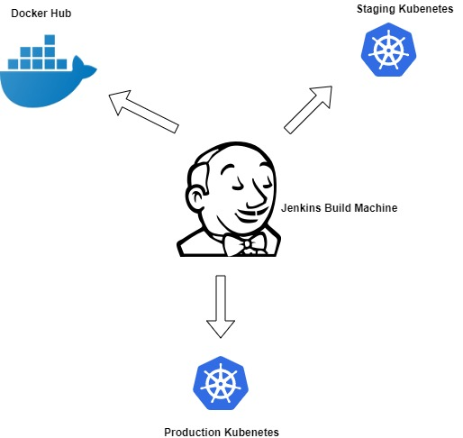
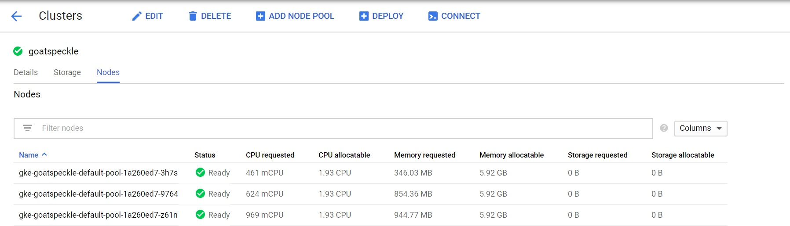
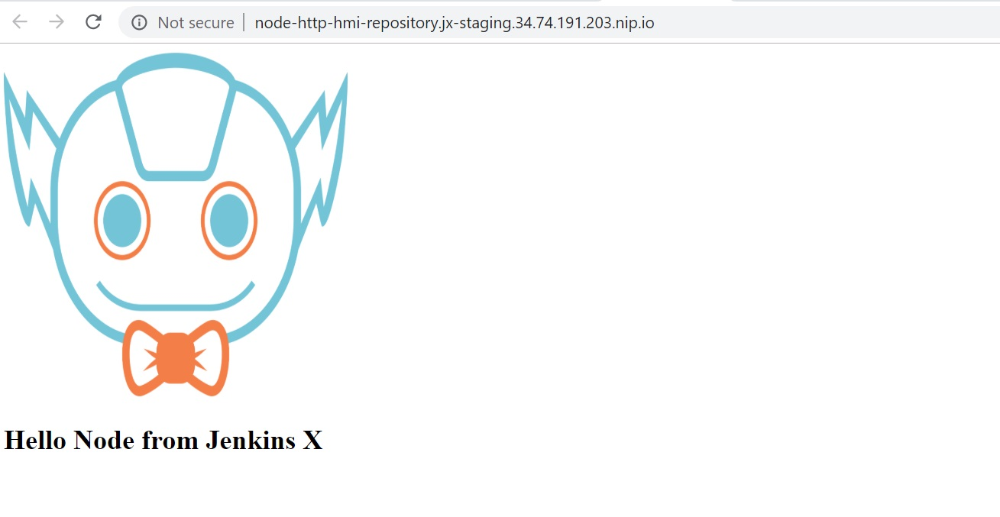
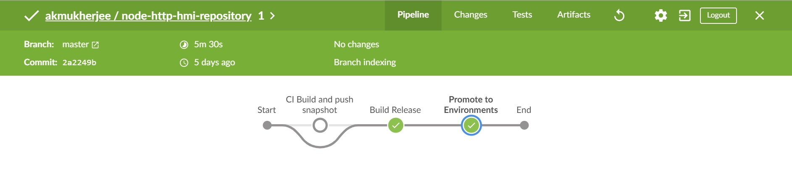
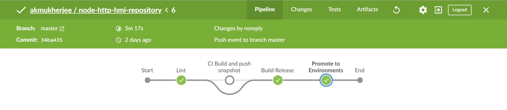
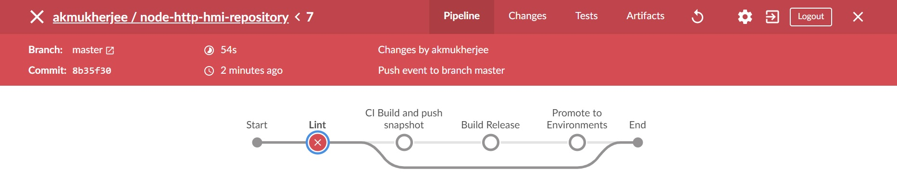

# Udacity Cloud DevOps Capstone Project 

This is the final Capstone Cloud DevOps Project

## Project Overview

In this project, a simple NodeJS application is deployed using JenkinsX and Kubernetes. A full CI/CD Pipeline has be created which first lints and then builds the NodeJS code base and then if the build is successful, the code first gets deployed to Staging and then if approved it gets promoted to the Production environment. The ecosystem and its components are as shown below.

 

## Project Steps

###  Cluster Creation

The project was created on the Google Cloud Platform due to known issues with running JenkinsX. JenkinsX was first installed on a GCP Virtual Machine and subsequently a GCP Cluster was created as shown below. The Cluster contains a 3 Worker Nodes.

 

###  Codebase Creation

A Simple NodeJS application was created using JenkinsX which displays a page as shown below and runs on the K8s Cluster created in the previous step and displays a simple Hello Node message. 

 

### Pipeline Creation

The above steps result in creation of a simple Pipeline which creates a Docker Image and upon successfult build uploads the image to DockerHub and deploys it to the Staging Environment first. A Canary strategy is used here where if the deployment works on the Staging Environment it gets deployed to the Production Environment.

 

### Addition of a Lint Step

A Linting Step has been added to the pipeline to lint the NodeJS application. The lint uses a .esrclint.json file which provides basic linting rules and updates to the package.json file to add the npm command and to the Jenkins file to add a linting stage. After the linting stage the updated pipeline looks as below.

 

### Lint Error Demonstration

A Linting Error is deliberately introduced by tweaking the server.js file and as shown below the pipeline fails due to the error generated as a result.

 

